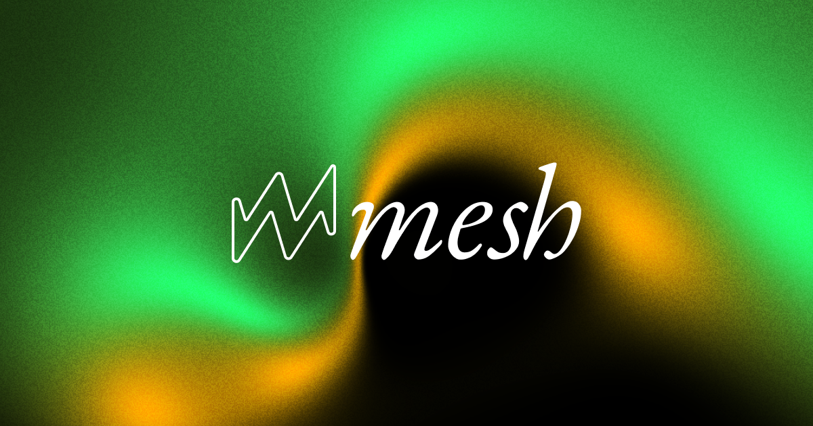

# MeshGrad 🎨

A beautiful, interactive WebGL mesh gradient generator with real-time warping and color manipulation.

## Features

✨ **Interactive Mesh Gradients** - Create stunning gradient meshes with smooth color interpolation  
🎛️ **Draggable Control Points** - Move color and warp points to reshape your gradient  
🎨 **Multiple Color Spaces** - Choose from RGB, OKLAB, HSL, or LCH interpolation  
🎲 **Smart Randomization** - Generate beautiful color palettes and random point configurations  
🎬 **Bouncing Animation** - Watch your gradient come alive with physics-based point animation  
📸 **High-Quality Export** - Export your creations as PNG images  
✨ **Subtle Noise Overlay** - Add texture with optional noise effects  
📱 **Responsive Design** - Works beautifully on any screen size

## Usage

### Getting Started
1. Open `index.html` in your browser
2. Use the floating controls in the top-right corner
3. Click anywhere to add warp points that bend the gradient
4. Drag the colored corner points to move color origins
5. Experiment with different settings and export your favorites!

### Controls
- **🎨 Color Pickers** - Change the four gradient colors
- **🎲 Randomize Colors** - Generate a new harmonious color palette
- **📍 Randomize Warp** - Create new warp points for gradient distortion  
- **🎯 Randomize Positions** - Move color points to new locations
- **▶️ Toggle Animation** - Start/stop bouncing ball physics
- **🌈 Color Space** - Switch between different interpolation modes
- **✨ Toggle Noise** - Add/remove subtle texture overlay
- **💾 Export PNG** - Save your gradient as an image
- **🔄 Reset** - Start fresh with new colors and default layout

### Interactions
- **Click** empty space to add warp points
- **Drag** any point to move it around
- **Double-click** warp points to remove them
- **Resize** your browser window for different aspect ratios

## Technical Details

Built with modern web technologies:
- **WebGL** for high-performance rendering
- **GLSL Shaders** for smooth gradient interpolation and mesh warping
- **Radial Basis Functions** for natural point-based deformation
- **Chroma.js** for intelligent color palette generation
- **ES6 Modules** for clean, maintainable code architecture

Perfect for designers, developers, and anyone who loves beautiful gradients! 🌈 